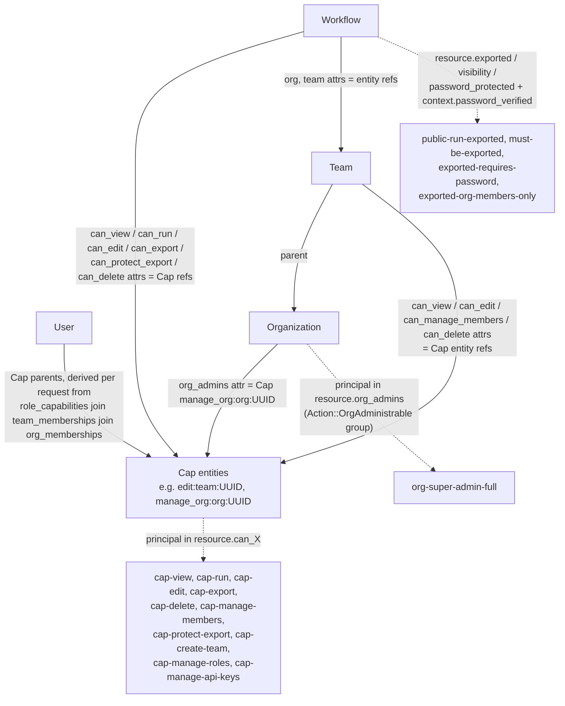

# Entity and policy model

Cedar never learns that roles exist. A `User`'s `Cap` parents are derived per
request by the `EntityProvider` from
`role_capabilities ⋈ team_memberships ⋈ org_memberships`; every `permit` policy
then tests parenthood (`principal in resource.can_X`), where `resource.can_X` is
itself a reference to a `Cap` entity. Solid arrows are entity **parents /
attributes**; dashed arrows show which attribute each policy family reads.

**Why `Cap` and not a role check:** every seeded capability is bound by exactly
one `cap-*` policy, and roles never appear in Cedar at all — a new role is 2
`INSERT`s into `roles` / `role_capabilities`, zero policy edits. `org_admins` is
just the `manage_org` capability group, so super-admin is not a hardcoded special
case, and because it is scoped to *the resource's own* `org_admins`, a
super-admin's power stops at their organization's boundary automatically.
