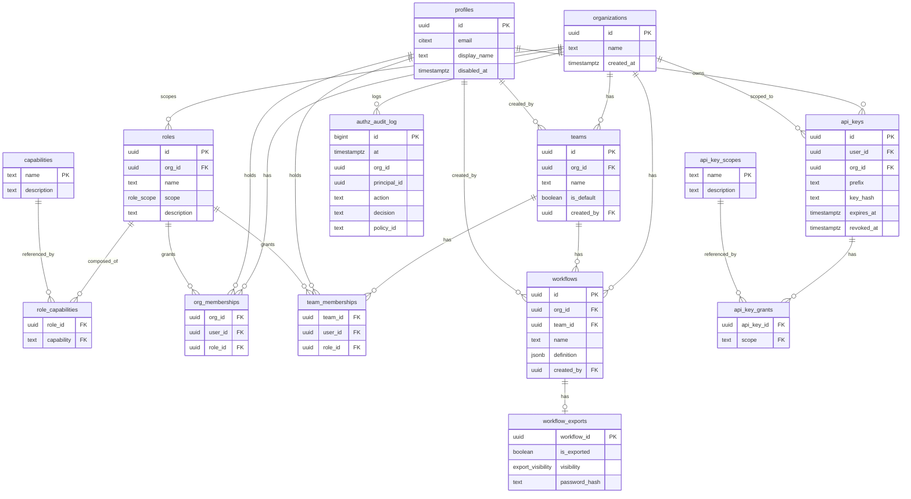

# ERD

The tables from `supabase/migrations/20260820000100_schema.sql`. `profiles` is the
only table that touches Supabase-owned identity (`auth.users`); everything else is
authorization and domain data owned by this service.

Notes not visible in the diagram itself:

- `profiles.id` references `auth.users(id) ON DELETE CASCADE` — populated by a
  trigger on `auth.users` insert, never a source of truth on its own.
- `roles.org_id IS NULL` marks a built-in role, shared by every tenant (partial
  unique index on `(name, scope)` for that case); non-null `org_id` scopes a
  custom role to exactly one org.
- `teams` has a partial unique index on `(org_id) WHERE is_default` — exactly one
  default team per org.
- `capabilities` and `api_key_scopes` are seed data, never user-writable.
