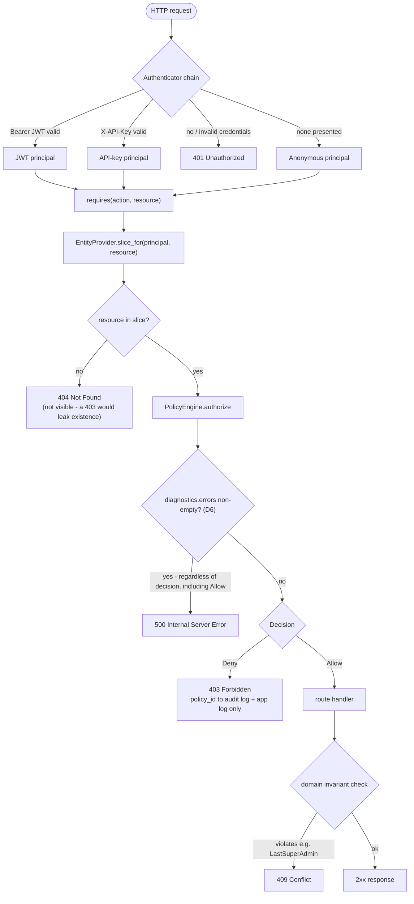

# Request flow

Every request that reaches a guarded route passes through the same choke point —
`requires(Action, ResourceRef)` — before the handler ever runs. The
diagnostics-error check (D6) is evaluated **before** the decision check, because an
`Allow` with errors is the dangerous case, not just a `Deny` with errors.

**Where each layer lives:** authentication (`app/auth/`) answers *who are you* and
exits at 401; authorization (`authz-core`, via `requires(...)`) answers *may you*
and exits at 403/404/500; domain invariants (`app/invariants/`, as Postgres
functions) answer *would the result be valid* and exit at 409. None of the three
imports another — see the README's Architecture section.
